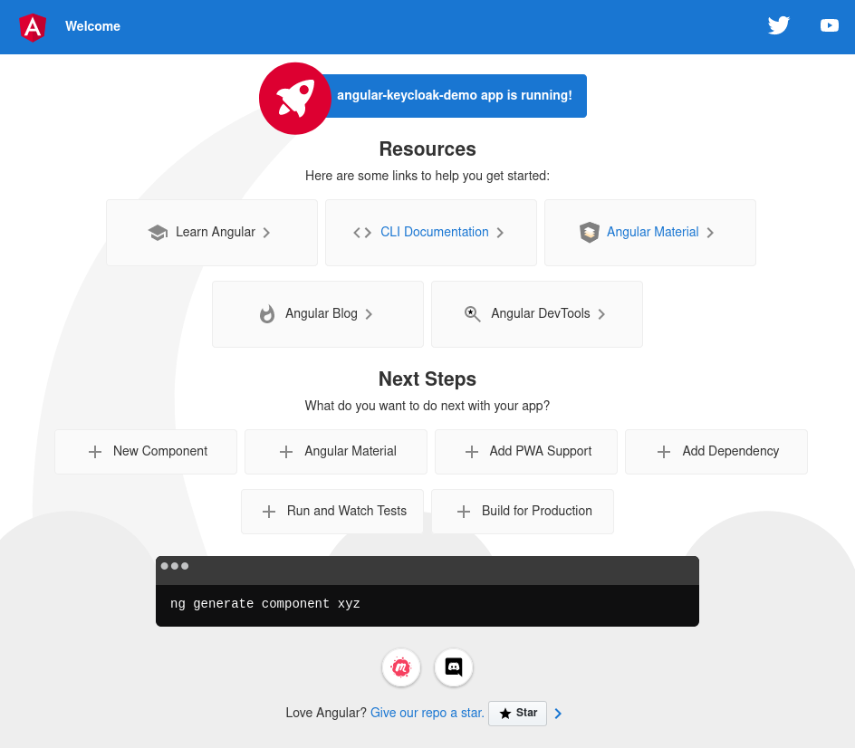

= Keycloak integration

== Angular

=== Start the provided demo
1. Fill in the missing placeholders in app.module.ts
+
(KEYCLOAK-DOMAIN, KEYCLOAK-REALM, CLIENT-ID)

2. Install dependencies
+
----
npm i
----

3. Run the project
+
----
npm run start
----

=== Build your own app

Create app:
----
ng new angular-keycloak-demo
----

Start app:
----
npm run start
----

Running app:

=== Add dependency

Add oidc package:
----
npm install angular-auth-oidc-client
----
Source:
https://www.npmjs.com/package/angular-auth-oidc-client

This library is certified by OpenID Foundation.

Note that the minimum Angular version is 14.
Information on how to update angular can be
found at https://update.angular.io/.

=== Configure OIDC provider

Add an import to src/app/app.module.ts:
----
import { AuthModule, LogLevel } from 'angular-auth-oidc-client';
----

Add AuthModule to imports (also in app.module.ts):
----
imports: [
    BrowserModule,
    AuthModule.forRoot({
      config: {
        authority: 'https://KEYCLOAK-DOMAIN/realms/KEYCLOAK-REALM',
        redirectUrl: window.location.origin,
        postLogoutRedirectUri: window.location.origin,
        clientId: 'CLIENT-ID',
        scope: 'openid profile email offline_access',
        responseType: 'code',
        silentRenew: true,
        useRefreshToken: true,
        logLevel: LogLevel.Debug
      }
    })
  ],
----
Some parts need to be replaced by the
actual values of the keycloak, that
you're using.
(KEYCLOAK-DOMAIN, KEYCLOAK-REALM, CLIENT-ID)

=== Use OIDC

Add the following code blocks to
the angular component, that you want
to use for authentication.

e.g. src/app/app.component.ts

Import the oidc service:
----
import { OidcSecurityService } from 'angular-auth-oidc-client';
----

Add parameter to constructor of the ts file:
----
constructor(public oidcSecurityService: OidcSecurityService) {}
----

Add login / logout functionality:

----
ngOnInit() {
    this.oidcSecurityService
      .checkAuth()
      .subscribe(({ isAuthenticated, userData, accessToken, idToken }) => {
        this.userData = userData;
        console.log(userData);
      });
  }

  login() {
    this.oidcSecurityService
      .authorizeWithPopUp()
      .subscribe(({ isAuthenticated, userData, accessToken, errorMessage }) => {
        this.userData = userData;
        console.log(userData);
      });
    //this.oidcSecurityService.authorize();
  }

  logout() {
    this.oidcSecurityService
      .logoff()
      .subscribe((result) => console.log(result));
  }
----
Call the login() function to log-in.
Call the logout() function to log-out.
This can be done by using a button in the frontend, or automatically when loading the page -> use isAuthenticated in ngOnInit for this.

The above shown implementation of login
redirects to a dedicated keycloak-login page.
This can be changed
by using .authorize instead of .authorizeWithPopup
(e.g. if you want
to create your own customized login page
instead of the one provided by keycloak)
